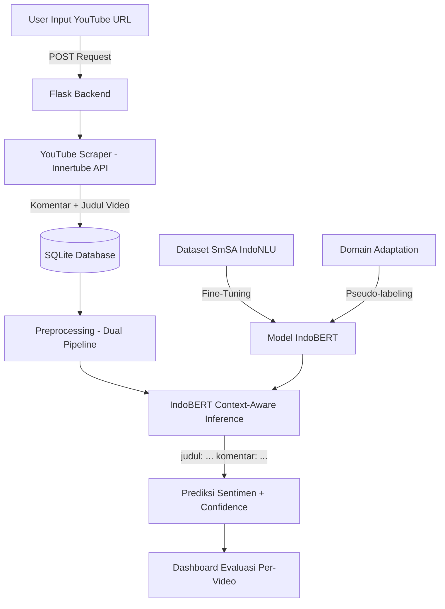

# Analisis Sentimen Komentar YouTube terhadap Program MBG Menggunakan IndoBERT

## 1. Deskripsi Project
Sistem web berbasis Flask untuk analisis sentimen komentar YouTube terhadap Program Makan Bergizi Gratis (MBG) menggunakan model IndoBERT. Sistem menggunakan pendekatan **context-aware** yang mengintegrasikan judul video ke dalam input model untuk mengatasi ambiguitas komentar pendek.

### Fitur Utama
- **Scraping YouTube** otomatis dengan ekstraksi judul video
- **Dual-pipeline preprocessing** (storage vs model) dengan kamus slang 200+ kata
- **Fine-tuning IndoBERT** menggunakan dataset SmSA IndoNLU
- **Context-aware inference** — judul video menjadi konteks prediksi
- **Domain adaptation** via pseudo-labeling untuk komentar YouTube
- **Evaluasi per-video** — data antar video tidak tumpang tindih
- **Dashboard interaktif** dengan distribusi sentimen, confidence analysis, dan deteksi kasus ambigu

## 2. Arsitektur Sistem


## 3. Struktur Folder
```text
Rekdat/
├── app.py                  # Entry point Flask + semua routes
├── config.py               # Konfigurasi path dan environment
├── extensions.py           # Inisialisasi SQLAlchemy
├── train_model.py          # Script fine-tuning IndoBERT
├── domain_adapt.py         # Script domain adaptation (pseudo-labeling)
├── requirements.txt        # Dependensi Python
├── readme.md               # Dokumentasi project
│
├── database/
│   └── comments.db         # SQLite database (gitignored)
│
├── indonlu/
│   └── dataset/
│       └── smsa_doc-sentiment-prosa/
│           ├── train_preprocess.tsv   # 11.000 data latih SmSA
│           ├── test_preprocess.tsv    # 500 data uji
│           └── valid_preprocess.tsv   # 1.260 data validasi
│
├── models/                 # Model weights (gitignored)
│   ├── indobert_finetuned/ # Hasil fine-tuning
│   └── indobert_adapted/   # Hasil domain adaptation
│
├── results/
│   └── model_metrics.json  # Metrik evaluasi model
│
├── services/
│   ├── scraper.py          # YouTube scraper (Innertube API)
│   ├── preprocessing.py    # Dual-pipeline preprocessing + slang dict
│   ├── sentiment.py        # IndoBERT inference (context-aware)
│   ├── database_service.py # SQLAlchemy ORM models
│   ├── export_service.py   # Export data ke CSV
│   └── topic_modeling.py   # LDA topic modeling
│
├── templates/
│   ├── layout.html         # Base template Bootstrap
│   ├── index.html          # Halaman scraping + live logs
│   ├── dashboard.html      # Dashboard utama
│   ├── preprocessing.html  # Preprocessing per-video
│   ├── finetuning.html     # Halaman pelatihan model
│   └── evaluasi.html       # Evaluasi sentimen per-video
│
├── static/
│   └── wordcloud/          # Hasil generate wordcloud
│
└── utils/
    ├── logger.py           # Konfigurasi logging
    ├── helper.py           # Fungsi utilitas
    └── lexicon.py          # Kamus leksikon sentimen
```

## 4. Tech Stack
| Kategori | Teknologi |
|---|---|
| **Backend** | Python 3.11, Flask, Flask-SQLAlchemy |
| **Database** | SQLite |
| **ML/NLP** | PyTorch, Transformers (HuggingFace), IndoBERT |
| **Dataset** | IndoNLU SmSA (11.000 data latih) |
| **Scraping** | Custom Innertube API scraper |
| **Frontend** | HTML5, Bootstrap 5, jQuery, DataTables, SweetAlert2 |

## 5. Performa Model

| Metrik | Nilai |
|---|---|
| Accuracy | 90,2% |
| F1-Score | 89,63% |
| Precision | 90,65% |
| Recall | 90,2% |

> Diukur pada 500 data uji SmSA IndoNLU setelah fine-tuning 5 epoch.

## 6. Cara Instalasi

### Prasyarat
- Python 3.9 - 3.11
- GPU dengan CUDA (opsional, untuk training)

### Langkah Instalasi
```bash
# 1. Clone repository
git clone https://github.com/username/Rekdat.git
cd Rekdat

# 2. Buat virtual environment
python -m venv .venv

# 3. Aktifkan virtual environment
# Windows:
.\.venv\Scripts\Activate.ps1
# Linux/Mac:
source .venv/bin/activate

# 4. Install dependensi
pip install -r requirements.txt

# 5. Install PyTorch (sesuaikan versi CUDA)
pip install torch --index-url https://download.pytorch.org/whl/cu121
```

## 7. Cara Menjalankan

```bash
# Pastikan virtual environment aktif
python app.py
```

Buka browser: `http://127.0.0.1:5000`

### Alur Penggunaan
1. **Tahap 1 - Scraping**: Input URL YouTube → sistem scraping komentar + judul video
2. **Tahap 2 - Preprocessing**: Pilih video → preprocessing data (normalisasi slang, hapus noise)
3. **Tahap 3 - Pelatihan AI** *(opsional)*: Fine-tune IndoBERT dengan dataset SmSA
4. **Tahap 4 - Evaluasi**: Pilih video → evaluasi sentimen context-aware → lihat distribusi + confidence

### Training Model (Opsional)
```bash
# Fine-tuning IndoBERT
python train_model.py

# Domain adaptation (setelah scraping data YouTube)
python domain_adapt.py
```

## 8. Kontributor

| Nama | NIM |
|---|---|
| Matin Rusydan | 237006030 |
| Daffa Bariq Suwandi | 237006021 |
| Aditya L Putra | 237006183 |

**Jurusan Informatika — Fakultas Teknik — Universitas Siliwangi — 2026**